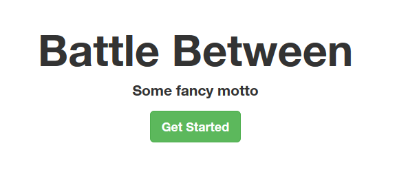
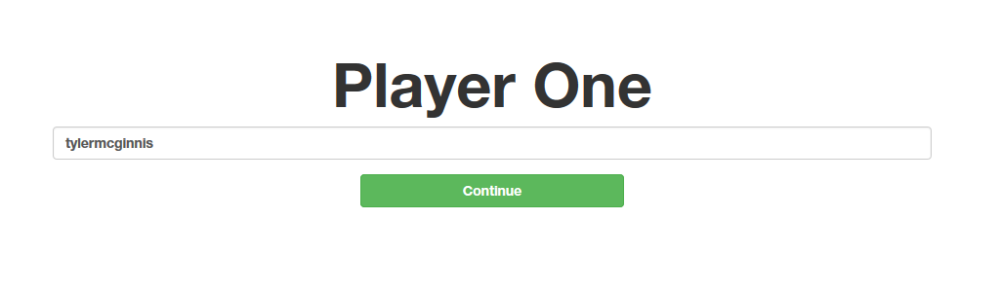
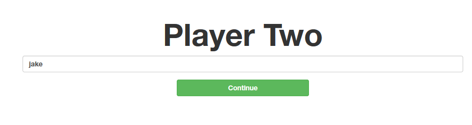
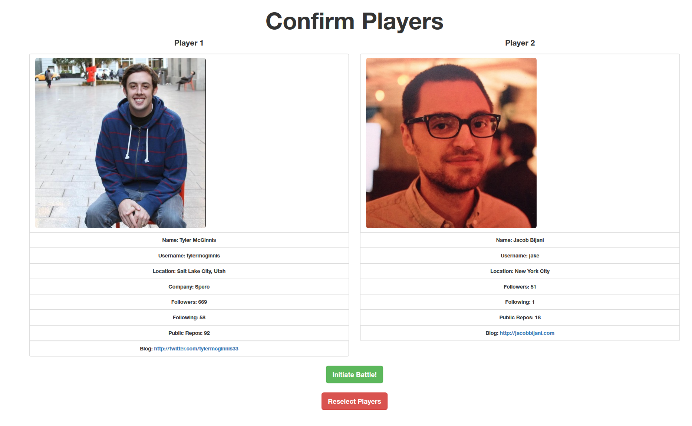
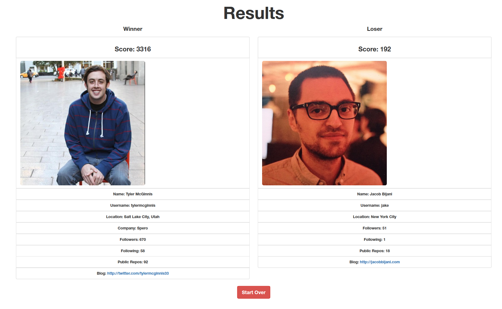

 

本篇实践一个案例，从GitHub把2个用户取出来，进行比较。先来看需要实现的效果：

 

**1、首页**

 

点击Get Started进入到下一页。

 

**2、输入第一个Github用户的用户名**

此时的路由我们希望是这样的：`http://localhost:8080/#/playerOne?`,点击Continue进入到下一页。

 

**3、输入第二个用户的用户名**

此时的路由我们希望是这样的：`http://localhost:8080/#/playerTwo/tylermcginnis`，点击Continue进入到最终的比较页面。

 

**4、最终比较的页面**

此时的路由我们希望是这样的：`http://localhost:8080/#/battle?playerOne=tylermcginnis&playerTwo=jake`。

 

**5、还有一个根据分数决出胜负的页面**

 

此时的路由我们希望是这样的：`http://localhost:8080/#/results`。

 

# 1、路由 #

 

**1.1 &nbsp;&nbsp;什么是路由？**

React的路由是把uri或组件匹配起来。

 

**1.2 &nbsp;&nbsp;分析**

在输入第一个用户和第二个用户的页面基本相似，就是url和标题不一样，所以是同一个组件。另外，在设计React组件的时候有一种习惯比较好：就是把只用来显示无状态的做成一个组件，比如说叫`Sth.js`,该组件还有其它的行为和状态，设计成`SthContainer.js`,在`SthContainer.js`中使用`Sth.js`。

 
Sth.js

	function Sth(props){
		return ()
	}

	module.exports = Sth;

以上，Sth函数叫做`无状态函数组件`，意思是说，当一个组件只关乎显示、与状态无关的时候，我们就不用写成`React.createClass()`的形式了，直接写成`无状态函数组件`的形式。

 
SthContainer.js

	var SthContainer = React.createClass({
		render: function(){
			<Sth />
		}
	});

 

**1.3 &nbsp;&nbsp;文件结构**

 

	components/
	.....Main.js
	.....Home.js
	.....Prompt.js(输入第一、第二个用户时用到)
	.....ConfirmBattle.js(比较页用到)
	......UserDetail.js(比较页用到)
	.....UserDetailWrapper.js(比较页用到)
	config/
	.....routes.js
	containers/
	.....PromptContainer.js(输入第一、第二个用户时用到)
	.....ConfirmBattleContainer.js(比较页用到)
	index.html
	index.js
	styles/
	......index.js
	utils/
	.....githubHelpers.js(从github获取数据时使用)

- components目录用来放无状态的组件
- config目录用来放路由配置
- containers目录用来放于状态有关的组件
- styles目录存放样式

 

**1.4 &nbsp;&nbsp;routes.js**

 
	
	var React = require('react');
	var ReactRouter = require('react-router');
	var Router = ReactRouter.Router;
	var Route = ReactRouter.Route;
	var hashHistory = ReactRouter.hashHistory;
	var IndexRouter = ReactRouter.IndexRoute;
	
	var Main = require('../components/Main');
	var Home = require('../components/Home');
	var PromptContainer = require('../containers/PromptContainer');
	var ConfirmBattleContainer = require('../containers/ConfirmBattleContainer');
	
	var routes = (
	    <Router history={hashHistory}>
	        <Route path='/' component={Main}>
	            <IndexRouter  component={Home} />
	            <Route path='playerOne' header='Player One' component={PromptContainer} />
	            <Route path='playerTwo/:playerOne' header='Player Two' component={PromptContainer} />
	            <Route path='battle' component={ConfirmBattleContainer} />
	        </Route>
	    </Router>
	);

	module.exports = routes;

 

**1.5 &nbsp;&nbsp;index.js**

 

	var React = require('react');
	var ReactDOM = require('react-dom');
	var routes = require('./config/routes');
	
	ReactDOM.render(
	    routes,
	    document.getElementById('app')
	);

可见，路由也是组件。

 

# 2、首页 #

 

首页就是一个组件，被封装在了`Home.js`中:

	var React = require('react');
	var transparentBg = require('../styles').transparentBg;
	var ReactRouter = require('react-router');
	var Link = ReactRouter.Link;
	
	var Home = React.createClass({
	    render: function(){
	        return (
	            

	                <h1>Battle Between</h1>
	                
Some fancy motto

	                <Link to='/playerOne'>
	                    <button type='button' className='btn btn-lg btn-success'>Get Started</button>
	                </Link>
	            

	        )
	    }
	});
	
	module.exports = Home;

- `style={transparentBg}`,把样式的设置放在了`styles/index.js`中
- `var Link = ReactRouter.Link`用来路由跳转

 
styles/index.js

	var styles = {
	    transparentBg: {
	        background: 'transparent'
	    },
	    space: {
	        marginTop: '25px'
	    }
	};
	
	module.exports = styles;

 

# 3、输入第一个用户、第二个用户页面 #

 

**3.1 &nbsp; &nbsp;用来显示，与状态无关的组件放在了`components/Prompt.js`中：**

	var React = require('react');
	var transparentBg = require('../styles').transparentBg;
	var PropTypes = React.PropTypes;
	
	//functional stateless components
	function Prompt(props){
	        return (
	            

	                <h1>{props.header}</h1>
	                

	                    <form onSubmit={props.onSubmitUser}>
	                        

	                            <input
	                                className="form-control"
	                                placeholder="Github Username"
	                                onChange={props.onUpdateUser}
	                                value={props.username}
	                                type="text" />
	                        

	                        

	                            <button
	                                className="btn btn-block btn-success"
	                                type="submit">
	                                    Continue
	                            </button>
	                        

	                    </form>
	                

	            
        
	        )   
	}
	
	Prompt.propTypes = {
	    header: PropTypes.string.isRequired,
	    onSubmitUser: PropTypes.func.isRequired,
	    onUpdateUser: PropTypes.func.isRequired,
	    username: PropTypes.string.isRequired   
	};
	
	
	module.exports = Prompt;

- Prompt在这里是一个无状态的函数组件
- `<form onSubmit={props.onSubmitUser}>`表单的提交依赖于`props.onSubmitUser`
- `onChange={props.onUpdateUser}`input的onChange事件依赖于`props.onUpdateUser`
- `value={props.username}`input的值依赖于`props.username`
- 标题的显示依赖于`{props.header}`

 

**3.2 &nbsp; &nbsp;与状态有关的组件放在了`containers/PromptContainer.js`中**

	var React = require('react');
	
	var Prompt = require('../components/Prompt');
	
	var PromptContainer = React.createClass({
	    contextTypes:{
	        router: React.PropTypes.object.isRequired
	    },
	    getInitialState: function(){
	        return{
	            username: ''
	        }
	    },
	    handleUpdateUser: function(e){
	        this.setState({
	            username: e.target.value
	        })
	    },
	    handleSubmitUser: function(e){
	        e.preventDefault();
	        
	        var usename = this.state.username;
	        this.setState({
	            username: ''
	        });
	        
	        if(this.props.routeParams.playerOne){
	            //go to battle
	            //console.log(this.context);
	            this.context.router.push({
	                pathname: '/battle',
	                query: {
	                    playerOne: this.props.routeParams.playerOne,
	                    playerTwo: this.state.username
	                }
	            });
	        } else {
	            //go to /playerTwo
	            //console.log(this.context);
	            this.context.router.push('/playerTwo/' + this.state.username)
	        }
	    },
	    render: function(){    
	        return (
	            <Prompt onSubmitUser={this.handleSubmitUser}
	            onUpdateUser={this.handleUpdateUser}
	            header={this.props.route.header}
	            username={this.state.username}/>
	        )
	    }
	})
	
	module.exports = PromptContainer;

 

**3.2.1 &nbsp; &nbsp;路由放在了哪？**
放在`this.context.router`中了。

 

**3.2.2 &nbsp;&nbsp;路由变量放哪了？**
比如，我们刚开始是这样定义路由的`<Route path='playerTwo/:playerOne' header='Player Two' component={PromptContainer} />`，路由变量到底被存放在哪里了呢？放在了`this.props.routeParams.playerOne`中了。

 

**3.2.3 &nbsp;&nbsp;如何切换路由？**
通过`this.context.router.push({pathname: '', query:{}})`,其中pathname用来存放路由名称，query用来存放查询参数的键值对

 

**3.2.3 &nbsp;&nbsp;其它**

 

- Prompt组件所依赖的`props.onSubmitUser`交给了这里的`{this.handleSubmitUser}`,通过判断路由变量playOne是否有值来决定跳转到那个路由，以及带上那些查询字符串
- Prompt组件所依赖的'props.onUpdateUser'交给了这里的`{this.handleUpdateUser}`，其实就是把文本框中的值复制给`this.username`
- Prompt组件所依赖的'props.header'交给了这里的`{this.props.route.header}`,就是到路由的header属性中找
- Pompt组件所依赖的`props.username`需要到状态中的username中去找
- 对路由的约束需要放在contextTypes中

 

# 4、最终比较页 #

 

**4.1 &nbsp; &nbsp;components/ConfirmBattle.js用来定义无状态函数组件**

 

	var React = require('react');
	var PropTypes = React.PropTypes;
	var styles = require('../styles');
	var ReactRouter = require('react-router');
	var Link = ReactRouter.Link;
	var UserDetailsWrapper = require('./UserDetailsWrapper');
	var UserDetails = require('./UserDetails');
	
	function ConfirmBattle (props) {
	  return props.isLoading === true
	    ? 
LOADING

	    : 

	        <h1>Confirm Players</h1>
	        

	          <UserDetailsWrapper header='Player 1'>
	            <UserDetails info={props.playersInfo[0]} />
	          </UserDetailsWrapper>
	          <UserDetailsWrapper header='Player 2'>
	            <UserDetails info={props.playersInfo[1]} />
	          </UserDetailsWrapper>
	        

	        

	          

	            <button type='button' className='btn btn-lg btn-success' onClick={props.onInitiateBattle}>Initiate Battle!</button>
	          

	          

	            <Link to='/playerOne'>
	              <button type='button' className='btn btn-lg btn-danger'>Reselect Players</button>
	            </Link>
	          

	        

	      

	}
	
	ConfirmBattle.propTypes = {
	  isLoading: PropTypes.bool.isRequired,
	  onInitiateBattle: PropTypes.func.isRequired,
	  playersInfo: PropTypes.array.isRequired,
	}
	
	module.exports = ConfirmBattle;

- 通过propTypes对props的属性进行约束
- 要来UserDetails组件，而UserDetailsWrapper组件是UserDetails组件的包裹层
- ConfirmBattle通过`props.isLoading`,`props.playersInfo`,`props.onInitiateBattle`属性接受外界的值

 

UserDetails组件是通过其info属性获取值，被定义在了`components/UserDetails.js`中了：

	var React = require('react');
	var PropTypes = React.PropTypes
	
	function UserDetails (user) {
	  return (
	    

	      {!!user.score && <li className="list-group-item"><h3>Score: {user.score}</h3></li>}
	      <li className="list-group-item"> </li>
	      {user.info.name && <li className="list-group-item">Name: {user.info.name}</li>}
	      <li className="list-group-item">Username: {user.info.login}</li>
	      {user.info.location && <li className="list-group-item">Location: {user.info.location}</li>}
	      {user.info.company && <li className="list-group-item">Company: {user.info.company}</li>}
	      <li className="list-group-item">Followers: {user.info.followers}</li>
	      <li className="list-group-item">Following: {user.info.following}</li>
	      <li className="list-group-item">Public Repos: {user.info.public_repos}</li>
	      {user.info.blog && <li className="list-group-item">Blog: <a href={user.info.blog}> {user.info.blog}</a></li>}
	    

	  )
	}
	
	UserDetails.propTypes = {
	  score: PropTypes.number,
	  info: PropTypes.shape({
	    avatar_url: PropTypes.string.isRequired,
	    blog: PropTypes.string,
	    company: PropTypes.string,
	    followers: PropTypes.number.isRequired,
	    following: PropTypes.number.isRequired,
	    location: PropTypes.string,
	    login: PropTypes.string.isRequired,
	    name: PropTypes.string,
	    public_repos: PropTypes.number.isRequired,
	  })
	}
	
	module.exports = UserDetails;

- 这里的user就相当于React.createClass中的props
- 其实UserDetails是依赖info接受外界的值

 

components/UserDetailsWrapper.js中定义的组件实际就是UserDetails组件的包裹层：

	var React = require('react');
	var PropTypes = React.PropTypes;
	
	function UserDetailsWrapper (props) {
	  return (
	    

	      
{props.header}

	      {props.children}
	    

	  )
	}
	
	UserDetailsWrapper.propType = {
	  header: PropTypes.string.isRequired,
	}
	
	module.exports = UserDetailsWrapper;

以上，包裹层想把里面的组件显示出来，就使用`props.children`。

 

**4.2 &nbsp; &nbsp;containers/ConfirmBattleContainer.js用来定义有状态的组件**

 

	var React = require('react');
	var ConfirmBattle = require('../components/ConfirmBattle');
	var githubHelpers = require('../utils/githubHelpers');
	
	var ConfirmBattleContainer = React.createClass({
	  contextTypes: {
	    router: React.PropTypes.object.isRequired
	  },
	  getInitialState: function () {
	    return {
	      isLoading: true,
	      playersInfo: [],
	    }
	  },
	  componentDidMount: function () {
	    var query = this.props.location.query;
	    githubHelpers.getPlayersInfo([query.playerOne, query.playerTwo])
	      .then(function (players) {
	        this.setState({
	          isLoading: false,
	          playersInfo: [players[0], players[1]]
	        })
	      }.bind(this))
	  },
	  handleInitiateBattle: function () {
	    this.context.router.push({
	      pathname: '/results',
	      state: {
	        playersInfo: this.state.playersInfo
	      }
	    })
	  },
	  render: function () {
	    return (
	      <ConfirmBattle
	        isLoading={this.state.isLoading}
	        onInitiateBattle={this.handleInitiateBattle}
	        playersInfo={this.state.playersInfo} />
	    )
	  }
	});
	
	module.exports = ConfirmBattleContainer;

- ConfirmBattle组件的isLoading属性从状态变量isLoading中获取值
- ConfirmBattle组件的onInitiateBattle属性从这里的handleInitiateBattle中获取值
- ConformBattle组件的playersInfo属性从状态变量playersInfo获取值
- contextTypes用来约束路由
- getInitialState用来设置初始值
- componentDidMount事件在组件绑定到DOM之后发生
- `this.props.location.query`获取本页的查询字符串对象
- 通过githubHelpers与远程交互

 
与github的交互封装在了utils/githubHelpers.js中：

	var axios = require('axios');
	
	var id = "YOUR_CLIENT_ID";
	var sec = "YOUR_SECRET_ID";
	var param = "?client_id=" + id + "&client_secret=" + sec;
	
	function getUserInfo(username){
	    return axios.get('https://api.github.com/users/' + username + param)
	}
	
	var helpers = {
	    getPlayersInfo: function(players){
	        return axios.all(players.map(function(username){
	            return getUserInfo(username);
	        })).then(function(info){
	          //console.log('INFO', info);
	            return info.map(function(user){
	                return user.data;
	            })
	        }).catch(function(err){
	            console.warn('Error in getPlayersInfo', err);
	        })
	    }
	};
	
	module.exports = helpers;

- axios用来远程交互
- axios.all等所有promise结束
- then完还是一个promise

 

# 5、根据分数决出胜负的页面 #

 

在比较页面，点击"Initiate Battle"按钮后来到的页面。这个按钮放在了component/ConfirmBattle.js中：

	

	

	  

	    <button type='button' className='btn btn-lg btn-success' onClick={props.onInitiateBattle}>Initiate Battle!</button>
	  

	  

	    <Link to='/playerOne'>
	      <button type='button' className='btn btn-lg btn-danger'>Reselect Players</button>
	    </Link>
	  

	

以上，ConfirmBattle由属性`props.onInitiateBattle`接受事件的定义。

 

然后，就来到ConfirmBattleContainer这个组件中，来看`props.onInitiateBattle`是如何被定义的：

	handleInitiateBattle: function () {
	this.context.router.push({
	  pathname: '/results',
	  state: {
	    playersInfo: this.state.playersInfo
	  }
	})
	},
	render: function () {
	return (
	  <ConfirmBattle
	    isLoading={this.state.isLoading}
	    onInitiateBattle={this.handleInitiateBattle}
	    playersInfo={this.state.playersInfo} />
	)
	}
 
以上，最终交给了handleInitateBattle方法，在这个方法中，使用`this.context.router.push`方法设定了路由，并把当前状态下的playersInfo的值赋值给了下一个页面的状态。

 

而新路由`/results`，在config/routes.js中也必然有对应的配置，如下：
	
	var routes = (
	    <Router history={hashHistory}>
	        <Route path='/' component={Main}>
	            <IndexRouter  component={Home} />
	            <Route path='playerOne' header='Player One' component={PromptContainer} />
	            <Route path='playerTwo/:playerOne' header='Player Two' component={PromptContainer} />
	            <Route path='battle' component={ConfirmBattleContainer} />
	            <Route path='results' component={ResultsContainer} />
	        </Route>
	    </Router>
	);

 

接下来就应该来到Results和ResultsContainer这个2个组件了。首先，来到Results这个无状态函数组件：

	var React = require('react');
	var PropTypes = React.PropTypes;
	var styles = require('../styles');
	var ReactRouter = require('react-router');
	var Link = ReactRouter.Link
	var UserDetails = require('./UserDetails');
	var UserDetailsWrapper = require('./UserDetailsWrapper');
	var MainContainer = require('./MainContainer');
	
	function StartOver () {
	  return (
	    

	      <Link to='/playerOne'>
	        <button type='button' className='btn btn-lg btn-danger'>Start Over</button>
	      </Link>
	    

	  )
	}
	
	function Tie (props) {
	  return (
	    <MainContainer>
	      <h1>It's a Tie!</h1>
	      <StartOver />
	    </MainContainer>
	  )
	}
	function Results (props) {
	  if (props.isLoading === true) {
	    return 
 Loading 

	  }
	  if (props.scores[0] === props.scores[1]) {
	    return (
	      <Tie scores={props.scores} playersInfo={props.playersInfo}/>
	    )
	  }
	  var winningIndex = props.scores[0] > props.scores[1] ? 0 : 1;
	  var losingIndex = winningIndex === 0 ? 1 : 0;
	  return (
	    <MainContainer>
	      <h1>Results</h1>
	      

	        <UserDetailsWrapper header='Winner'>
	          <UserDetails score={props.scores[winningIndex]} info={props.playersInfo[winningIndex]} />
	        </UserDetailsWrapper>
	        <UserDetailsWrapper header='Loser'>
	          <UserDetails score={props.scores[losingIndex]} info={props.playersInfo[losingIndex]} />
	        </UserDetailsWrapper>
	      

	      <StartOver />
	    </MainContainer>
	  )
	}
	Results.propTypes = {
	  playersInfo: PropTypes.array.isRequired,
	  scores: PropTypes.array.isRequired
	}
	module.exports = Results;

- StartOver和Tie可以看做是私有组件,把代码可以重复利用的部分封装在这里
- MainContainer在很多地方能用到，就做成了一个公用组件

 

MainContainer组件被定义在了`components/MainContainer.js`中:

	var React = require('react');
	var styles = require('../styles');
	
	function MainContainer (props) {
	  return (
	    

	      {props.children}
	    

	  )
	}
	
	module.exports = MainContainer;

以上，有一个容易被忽视的注意点哦。在上面的无状态函数中，虽然没有显式用到React,但实际上在背后是调用了`React.createClass`的，所有这里的React并不能省略掉。

 

接着就来到了ResultsContainer组件了。

	var React = require('react');
	var Results = require('../components/Results');
	var githubHelpers = require('../utils/githubHelpers');
	
	var ResultsContainer = React.createClass({
	  getInitialState: function () {
	    return {
	      isLoading: true,
	      scores: []
	    }
	  },
	  componentDidMount: function () {
	    githubHelpers.battle(this.props.location.state.playersInfo)
	      .then(function (scores) {
	        this.setState({
	          scores: scores,
	          isLoading: false
	        })
	      }.bind(this))
	  },
	  render: function () {
	    return (
	      <Results
	        isLoading={this.state.isLoading}
	        playersInfo={this.props.location.state.playersInfo}
	        scores={this.state.scores} />
	    )
	  }
	});
	
	module.exports = ResultsContainer;

- Results组件通过isLoading属性接收的值来自状态
- Results组件通过playersInfo属性接收的值来自`this.props.location.state.playersInfo`，这里的值就是在点击比较页面上的"Initiate Battle"按钮是定义的，在ConfirmBattleContainer中定义的
- Results组件通过scores属性接收的值来自状态
- 改变状态的值是在组件绑定到DOM元素之后发生的，通过componentDidMount这个事件，调用githubHelpers的返回promise的方法。

 

再来看kutils/githubHelpers.js中的定义，与github有关：

	var axios = require('axios');
	
	var id = "YOUR_CLIENT_ID";
	var sec = "YOUR_SECRET_ID";
	var param = "?client_id=" + id + "&client_secret=" + sec;
	
	function getUserInfo (username) {
	  return axios.get('https://api.github.com/users/' + username + param);
	}
	
	function getRepos (username) {
	  return axios.get('https://api.github.com/users/' + username + '/repos' + param + '&per_page=100');
	}
	
	function getTotalStars (repos) {
	  return repos.data.reduce(function (prev, current) {
	    return prev + current.stargazers_count
	  }, 0)
	}
	
	function getPlayersData (player) {
	  return getRepos(player.login)
	    .then(getTotalStars)
	    .then(function (totalStars) {
	      return {
	        followers: player.followers,
	        totalStars: totalStars
	      }
	    })
	}
	
	function calculateScores (players) {
	  return [
	    players[0].followers * 3 + players[0].totalStars,
	    players[1].followers * 3 + players[1].totalStars
	  ]
	}
	
	var helpers = {
	  getPlayersInfo: function (players) {
	    return axios.all(players.map(function (username) {
	      return getUserInfo(username)
	    }))
	    .then(function (info) {
	      return info.map(function (user) {
	        return user.data
	      })
	    })
	    .catch(function (err) {console.warn('Error in getPlayersInfo: ', err)})
	  },
	  battle: function (players) {
	    var playerOneData = getPlayersData(players[0]);
	    var playerTwoData = getPlayersData(players[1]);
	    return axios.all([playerOneData, playerTwoData])
	      .then(calculateScores)
	      .catch(function (err) {console.warn('Error in getPlayersInfo: ', err)})
	  }
	};
	
	module.exports = helpers;

 

# 6、增加路由切换的效果 #

 

> npm install --save react-addons-css-transition-group
> npm install --save-dev css-loader style-loader

 

在webpack.config.js中增加相应的配置：

	var HtmlWebpackPlugin = require('html-webpack-plugin');
	var HtmlWebpackPluginConfig = new HtmlWebpackPlugin({
	    template: __dirname + '/app/index.html',
	    filename: 'index.html',
	    inject: 'body'
	})
	
	module.exports = {
	    entry: [
	        './app/index.js'
	    ],
	    output: {
	        path: __dirname + '/dist',
	        filename: "index_bundle.js"
	    },
	    module: {
	        loaders: [
	            {test: /\.js$/, exclude: /node_modules/, loader: "babel-loader"},
	            { test: /\.css$/, loader: "style-loader!css-loader" }
	        ]
	    },
	    plugins: [
	        HtmlWebpackPluginConfig
	    ]
	}

以上，在module中增加了style-loader和css-loader。

 

在app/main.css中添加需要的样式文件：

	.appear-enter {
	  transition-duration: .7s;
	  transition-property: opacity;
	  transition-timing-function: ease-out;
	  opacity: 0;
	}
	
	.appear-enter.appear-enter-active {
	  opacity: 1;
	}
	
	.appear-leave {
	  opacity: 0;
	}

 

在composite/Main.js修改如下：

	var React = require('react');
	var ReactCSSTransitionGroup = require('react-addons-css-transition-group');
	require('../main.css');
	
	var Main = React.createClass({
	  render: function () {
	    return (
	      

	        <ReactCSSTransitionGroup
	          transitionName="appear"
	          transitionEnterTimeout={500}
	          transitionLeaveTimeout={500}>
	            {React.cloneElement(this.props.children, {key: this.props.location.pathname})}
	        </ReactCSSTransitionGroup>
	      

	    )
	  }
	});
	
	module.exports = Main;

使用`React.cloneElement`能为组件添加上新的属性。

